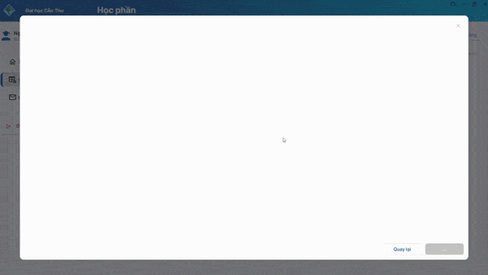
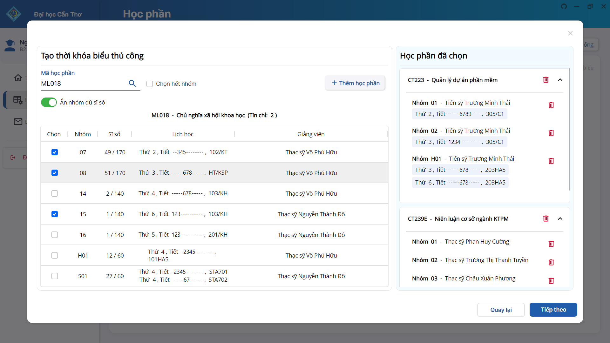
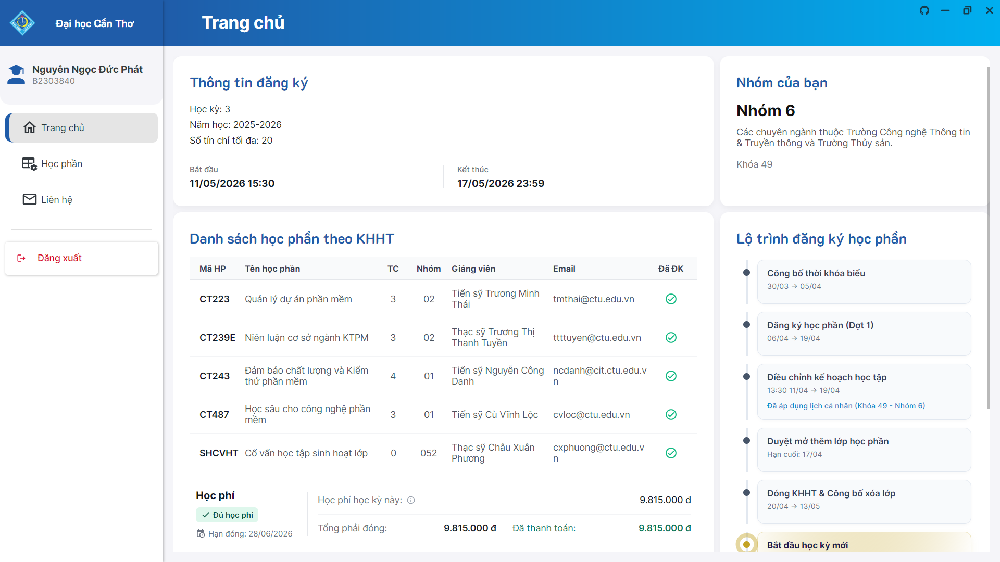
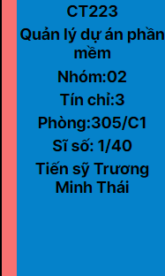
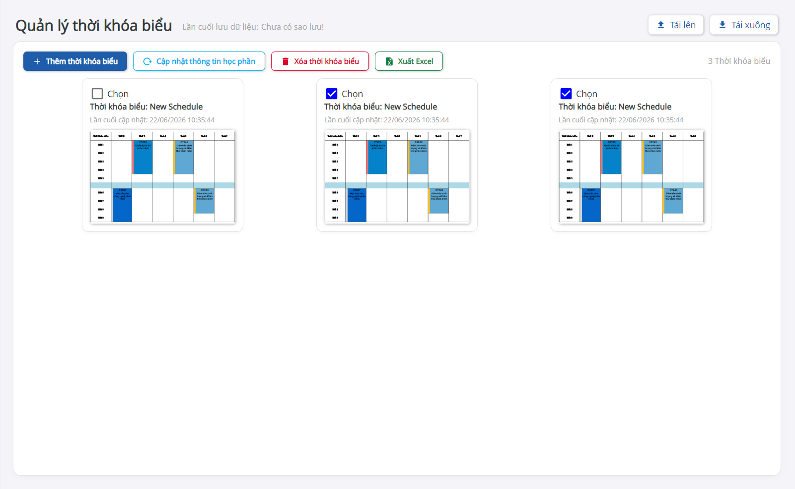
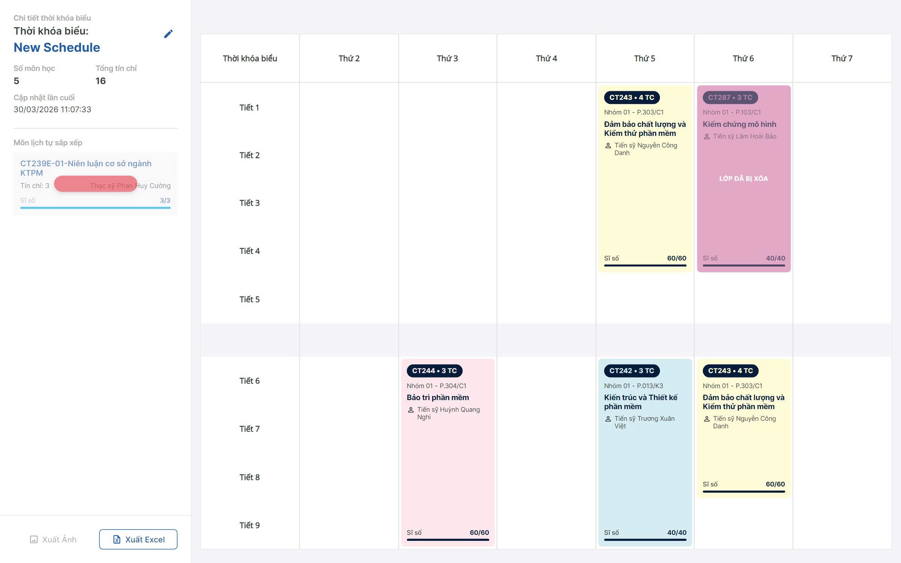
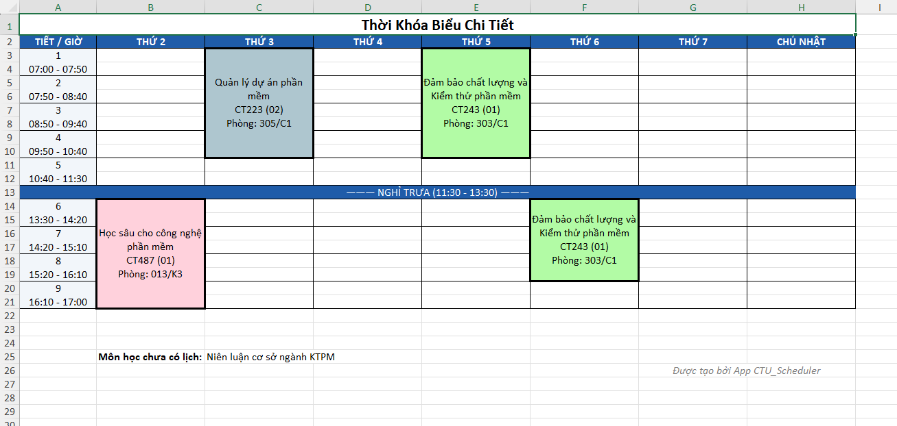
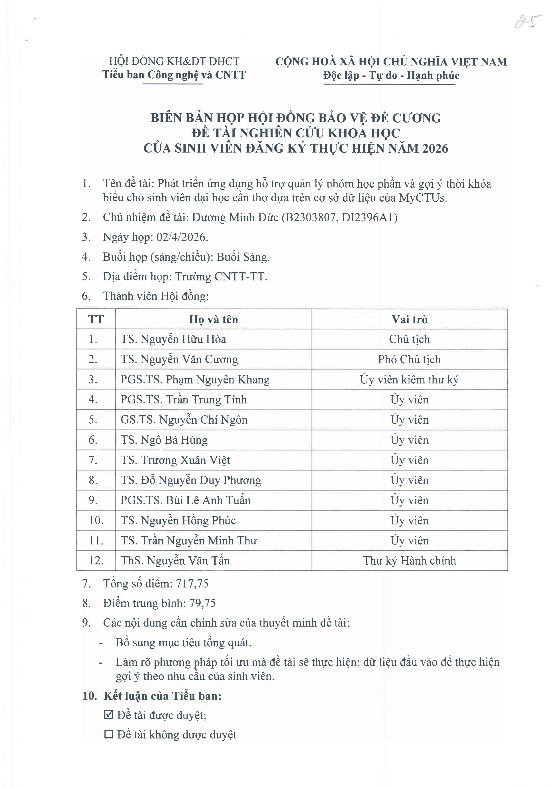

<p>&nbsp;</p>
<p align="center">
  
</p>

<p align="center">
  
  
  
</p>

<p align="center">
  <b>Công nghệ sử dụng</b>
</p>

<p align="center">
  
  
  
</p>

<p align="center"> Đừng quên thả Sao để tiếp thêm động lực cho nhóm mình nha!</p>

---

## [Video Demo](https://youtu.be/ubb4gyOioU0?si=qRQOwMNo4vsZeSlX)

## Mục lục

* [Tổng quan về CTU-Scheduler](#about)
* [Tính năng](#feature)
    * [Tạo thời khóa biểu nhanh](#auto)
    * [Tùy chỉnh lịch thủ công](#manual)
    * [Tổng hợp thông tin học tập](#info)
    * [Cập nhật sĩ số lớp học](#capacity)
    * [Quản lý nhiều thời khóa biểu](#manage)
    * [Trực quan thời khóa biểu & Xuất dữ liệu](#visualize)
* [Kiến trúc và công nghệ sử dụng](#architecture)
* [Biên bản họp hội đồng](#certification)
* [Cài đặt & Thiết lập](#setup)
* [Hướng dẫn sử dụng](#usage)
* [Đội ngũ phát triển](#author)
* [Đóng góp & Góp ý](#contributing)
* [Điều khoản sử dụng](#terms)
* [Giấy phép](#license)

## <a id="about"></a> Tổng quan về CTU-Scheduler

<p>
  

<strong>CTU-Scheduler</strong> là ứng dụng desktop mã nguồn mở giúp sinh viên <strong>Đại học Cần Thơ</strong> (CTU) lập
kế hoạch học tập và xếp lịch học. Ứng dụng hỗ trợ chạy đa nền tảng (Windows, macOS, Linux).
</p>
<p>
  Dự án NCKH này giải quyết bài toán đụng lịch và xếp thời khóa biểu thủ công. Thay vì tra cứu danh mục học phần, kẻ bảng Excel hay nháp lịch ra giấy mỗi đầu học kỳ, hệ thống sẽ tự động hóa quy trình xử lý để tạo ra các phương án xếp lịch.
</p>

## <a id="feature"></a> Tính năng

### <a id="auto"></a> Tạo thời khóa biểu nhanh

<table width="100%">
  <tr>
    <td width="50%"></td>
    <td width="50%">
      Giải quyết khâu tính toán lịch học tốn thời gian:
      <ul>
        <li>Tự động sinh thời khóa biểu từ các môn trong kế hoạch học tập đã thêm.</li>
        <li>Chỉ cần ấn tạo, chọn lịch ưng ý và hoàn thành.</li>
      </ul>
    </td>
  </tr>
</table>

### <a id="manual"></a> Tùy chỉnh lịch thủ công

<table width="100%">
  <tr>
<td width="50%">
      Dành cho người dùng muốn tự tay kiểm soát chi tiết từng giờ học:
      <ul>
        <li>Tự nhập các môn học muốn đăng ký.</li>
        <li>Tự do lựa chọn nhóm học, giảng viên và khung giờ cho từng môn.</li>
        <li>Sau khi chọn nhóm xong, kết quả hiển thị và thao tác lưu lịch tương tự chế độ tạo tự động.</li>
      </ul>
    </td>
    <td width="50%"></td>
  </tr>
</table>

### <a id="info"></a> Tổng hợp thông tin học tập

<table width="100%">
  <tr>
    <td width="50%"></td>
    <td width="50%">
      Thông tin học tập được hiển thị tập trung:
      <ul>
        <li><strong>Theo dõi mốc thời gian đăng ký:</strong> Xem trực tiếp lộ trình mở/đóng hệ thống.</li>
        <li><strong>Theo dõi môn học:</strong> Xem nhanh danh sách các môn trong Kế hoạch học tập (KHHT) và trạng thái đăng ký.</li>
        <li><strong>Theo dõi học phí:</strong> Xem tổng tiền phải đóng, hạn chót nộp và trạng thái thanh toán.</li>
      </ul>
    </td>
  </tr>
</table>

### <a id="capacity"></a> Cập nhật sĩ số lớp học

<table width="100%">
  <tr>
    <td width="50%"></td>
    <td width="50%">
      Theo dõi tình trạng chỗ trống của các nhóm môn học:
      <ul>
        <li>Đồng bộ dữ liệu sĩ số thực tế từ hệ thống trường.</li>
        <li>Giúp bạn xem trước nhóm học nào còn chỗ để lên kế hoạch đăng ký.</li>
      </ul>
    </td>
  </tr>
</table>

### <a id="manage"></a> Quản lý nhiều thời khóa biểu

<table width="100%">
  <tr>
    <td width="50%"></td>
    <td width="50%">
      Quản lý các phương án lịch học khác nhau:
      <ul>
        <li>Lưu lại nhiều phiên bản thời khóa biểu cùng lúc.</li>
        <li>So sánh và các lịch đã tạo để chọn phương án phù hợp nhất.</li>
      </ul>
    </td>
  </tr>
</table>

### <a id="visualize"></a> Trực quan thời khóa biểu & Xuất dữ liệu

Hiển thị lịch học dưới dạng lưới và hỗ trợ lưu trữ:
<ul>
  <li><strong>Sao chép ảnh:</strong> Chụp thời khóa biểu và lưu vào bộ nhớ tạm bằng một nút bấm. Nhấn <code>Ctrl + V</code> để dán và chia sẻ.</li>
  <li><strong>Xuất Excel:</strong> Kết xuất dữ liệu ra tệp Excel định dạng rõ ràng, sẵn sàng in ấn.</li> 
  <li><strong>Lưu trữ cấu hình:</strong> Xuất thời khóa biểu ra file JSON cục bộ để tải lại nhanh chóng.</li>
</ul>

<table width="100%">
  <tr>
    <td width="50%" align="center">
      
    </td>
    <td width="50%" align="center">
      
    </td>
  </tr>
</table>

## <a id="architecture"></a> Kiến trúc và công nghệ sử dụng

Dự án áp dụng **Clean Architecture** để quản lý mã nguồn và ứng dụng hoạt động ổn định:

* **Core Layer:** Chứa thuật toán xếp lịch nhanh, tối ưu bộ nhớ.
* **AppServices Layer:** Quản lý luồng hoạt động chính và lưu trữ tiến độ xếp lịch.
* **Infrastructure Layer:** Xử lý kết nối hệ thống trường (đăng nhập, lấy dữ liệu API) và đọc file PDF kế hoạch học tập.
* **Presentation Layer:** Giao diện đa nền tảng xây dựng bằng **Avalonia UI** (kèm thư viện Semi.Avalonia & Irihi.Ursa),
  tối ưu CPU.

## <a id="certification"></a> Biên bản họp hội đồng

* **Đề tài Nghiên cứu khoa học (NCKH) cấp trường**
* **Trạng thái:** Đã được hội đồng chuyên môn xét duyệt nghiệm thu và thông qua.
* **Đơn vị quản lý:** Trường Công nghệ Thông tin & Truyền thông - Đại học Cần Thơ.

<p align="center">
  
</p>

## <a id="setup"></a> Cài đặt & Thiết lập

### Dành cho người dùng

Cách nhanh nhất để tải và cài đặt ứng dụng là truy cập vào trang web chính thức của dự án:
🌐 **[Tải CTU-Scheduler tại đây](https://link-trang-web-cua-ban.com)**

Hoặc tải thủ công qua GitHub:

1. Truy cập trang [Releases](https://github.com/d3nhatv0lam/CTU-Scheduler/releases) của dự án.
2. Tải về phiên bản mới nhất phù hợp với hệ điều hành của bạn.
3. Giải nén và chạy file thực thi trực tiếp trên máy, không cần cài đặt thêm.

### Dành cho nhà phát triển

Nếu bạn muốn xem mã nguồn hoặc phát triển tiếp ứng dụng:

**Yêu cầu hệ thống:**

* [.NET SDK 10](https://dotnet.microsoft.com/download)
* [Git](https://git-scm.com/) để tải mã nguồn.

**Các bước thực hiện:**

1. Clone repository

```bash
https://github.com/d3nhatv0lam/CTU-Scheduler.git
```

2. Khôi phục các gói (Restore Dependencies):

```bash
dotnet restore "CTU Scheduler.slnx"
```

3. Build dự án:

```bash
dotnet build "CTU Scheduler.slnx" -c Release
```

4. Khởi chạy ứng dụng:

```bash
dotnet run --project CTUScheduler.Desktop/CTUScheduler.Desktop.csproj
```

## Hướng dẫn sử dụng

**Thao tác cơ bản:**

1. Mở ứng dụng, đăng nhập tài khoản sinh viên cổng thông tin CTU.
2. Đợi hệ thống tự động đồng bộ và tải thông tin đăng ký học phần mới nhất.
3. Chuyển sang tab **Học phần** ở thanh điều hướng bên trái.
4. Bấm **Thêm thời khóa biểu** để mở bảng cấu hình lập lịch.
5. Chọn phương thức **Thời khóa biểu nhanh** (máy tự động phối hợp lớp) hoặc **Thời khóa biểu thủ công** (tự chọn tay)
   tùy nhu cầu.
6. Bấm **Tạo thời khóa biểu** để nhận danh sách các phương án, chọn lịch ưng ý và bấm **Hoàn thành** để lưu lại.
7. Bạn có thể chọn **Export ra Excel** để in ấn hoặc kết xuất file JSON để lưu trữ cục bộ.

## Đội ngũ phát triển

Dự án NCKH này được nghiên cứu và phát triển bởi nhóm sinh viên Đại học Cần Thơ:

* **Dương Minh Đức** ([@d3nhatv0lam](https://github.com/d3nhatv0lam)) - Chủ nhiệm đề tài & Lead Developer, Tester
* **Nguyễn Phước Lộc** ([@Lexipit3268](https://github.com/Lexipit3268)) - Developer, Designer, Tester
* **Trần Trọng Phúc** ([@phuctran1501](https://github.com/phuctran1501)) - Developer, Tester
* **Nguyễn Ngọc Đức Phát** ([@KimgionDev](https://github.com/KimgionDev)) - Developer, Tester

## Đóng góp & Góp ý

Mọi ý kiến đóng góp và báo lỗi từ bạn sẽ giúp ứng dụng hoàn thiện hơn. Nếu bạn gặp khó khăn khi sử dụng hoặc có ý tưởng
mới, hãy chia sẻ với nhóm:

* **Báo lỗi & Góp ý:** Điền thông tin
  qua [Form phản hồi](https://docs.google.com/forms/d/e/1FAIpQLSfjU3UmQCetqDPxXowysP-OyfJc_QOscjXvdLepzJszug5u7w/viewform).
* **Đóng góp mã nguồn:** Nếu bạn muốn đóng góp code, vui lòng **Fork** repository này, tạo nhánh mới và gửi **Pull
  Request**. Bạn cũng có thể mở **Issue** trực tiếp.

## Điều khoản sử dụng

Xem chi tiết các quy định và tuyên bố miễn trừ trách nhiệm tại file [TERMS](./TERMS.md).

## Giấy phép

Dự án được phân phối dưới giấy phép MIT. Xem chi tiết tại file [LICENSE](./LICENSE).
